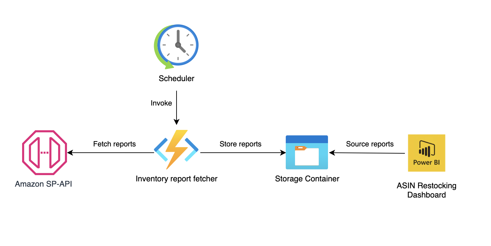
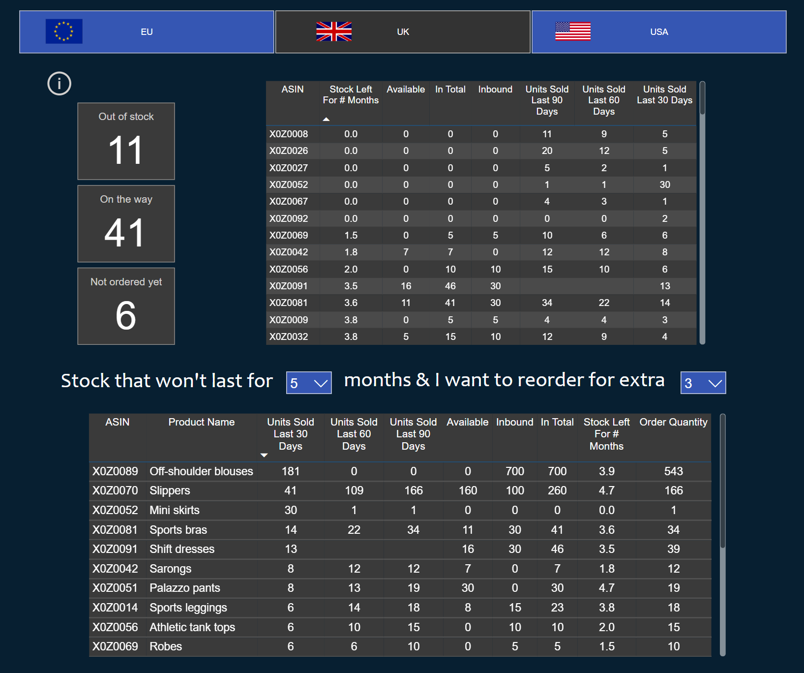

# Automated Amazon Inventory Reports with PowerBI for Restocking

## Overview
This solution streamlines the process for Amazon sellers by automating the requesting and downloading of Amazon inventory reports. It leverages the Amazon Selling Partner API (SP-API) to obtain inventory data, which is then analyzed using a PowerBI dashboard. This solution greatly reduces the manual workload involved in downloading and analyzing reports in Excel, facilitating efficient restocking decisions.

### Key Features
- Automated retrieval of Amazon inventory reports for USA and Europe.
- Integration with PowerBI for insightful restocking analysis with dynamic configuration.
- Utilization of Azure Function App and Storage Containers for efficient data handling.

## Components
1. **Azure Function App**: Consists of two scheduled functions. The first function handles inventory reports from Amazon USA using SP-API, and the second caters to Amazon Europe with a different refresh token.
2. **Azure Storage Containers**: Two containers named `30days-reports` and `90days-reports` store the downloaded reports, each serving a unique purpose in inventory analysis.
3. **PowerBI**: A data transformation module prepares the reports for analysis, and a dashboard displays the restocking information.

## Architecture

## Prerequisites
1. Register for Amazon Selling Partner API (SP-API) and create two private vendor applications with access to inventory reports for USA and Europe. Secure your Client ID, Client Secret, and two Refresh Tokens.
2. Install PowerBI Desktop.
3. Create an Azure Account (a free trial is available).
4. Install Visual Studio Code and the Azure Tools extension.

## Deployment Steps
1. **Clone the Repository**: Clone the repository to your local machine.
2. **Setup in Visual Studio Code**:
   - Open the repository in Visual Studio Code. Ensure you're signed in through Azure Tools.
   - Access the Command Palette using Ctrl+Shift+P (Windows) or Command+Shift+P (MacOS) and select 'Azure Functions: Create Function App in Azure… (Advanced)'. 
   - Give the Function App a unique name, select Python 3.11 as the runtime stack, create a new resource group with the same name as the Function App, and choose the nearest geographical location for your resources.
   - Opt for a "Consumption" hosting plan, create a new storage account and Application Insights resource, both named after your Function App.
3. **Create Azure Storage Containers**:
   - In Visual Studio Code, navigate to the Azure icon and expand your subscription and storage account details.
   - Right-click on 'Blob Containers', create two new containers named `30days-reports` and `90days-reports`.
   - Right-click on your storage account name to copy the Connection String.
4. **Configure Application Settings**:
   - Expand 'Function App', then your app in and right-click on 'Application Settings' and add the following settings:

| Name | Value |
| ------ | ------ |
| STORAGE_ACCOUNT_CONNECTION_STRING | <your connection string> |
| CLIENT_ID | <client id from prerequisites> |
| CLIENT_SECRET | <client secret from prerequisites> |
| REFRESH_TOKEN_EU | <refresh token for Europe> |
| REFRESH_TOKEN_USA | <refresh token for USA> |

5. **Deploy to Function App**:
   - Return to your cloned repository in Visual Studio Code, right-click on the project folder, and select 'Deploy to Function App…'. Choose your Function App as the destination.

## Function Scheduling
Functions are pre-configured to run daily at 9 AM in your selected location. They will overwrite existing reports therefore your dashboard will be updated daily. Modify the cron schedule in `function.json` to alter the timing.

## Testing Functions
In the Azure portal, navigate to your Function App, choose a function under 'Functions', select 'Code + Test', and then 'Test/Run'. If you are seeing a message about CORS, go back to the previous page, find CORS in the left hand menu and add https://portal.azure.com as an allowed origin. Logs will display the function's operations and the uploading of reports to your storage containers.

## Reports
Funtions fetch 30 and 90-day inventory reports for the USA, UK, Italy, France, Spain, and Germany. We need both the because the 90 day one provides a longer term selling patter but they don’t include any out of stock ASINs, and to address this we also include 30 days reports.

## Connecting to PowerBI
1. Open `amazon-restock-inventory-dashboard.pbix` in PowerBI.
2. Cick on 'Transform data' in the top menu. Within `90days` folder, click on `Sample File` and in the source, replace `<your_storage_account_name>` with your Azure storage account name.
3. When prompted for an `Account Key`, return to Visual Studio Code, navigate to your storage account, right-click and copy the `Primary Key`.
4. Update the source for `90day-reports` file and same updates to the `Sample File` and `30day-reports` files inside `30days` folder.

## Finalizing PowerBI Dashboard
Click "Close & Apply" in PowerBI to load the data and view the dashboard.

## Conclusion
This solution automates the critical task of inventory management for Amazon sellers. It simplifies the process of understanding restocking needs, reducing manual efforts, and enabling more effective decision-making through the PowerBI dashboard.
